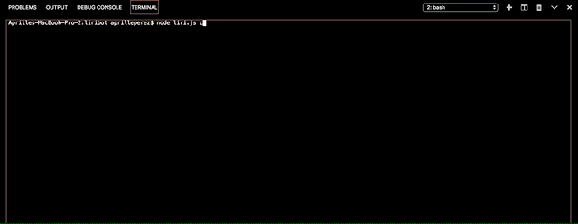
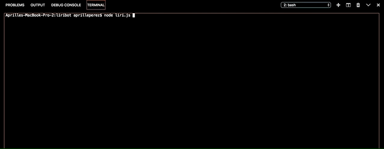
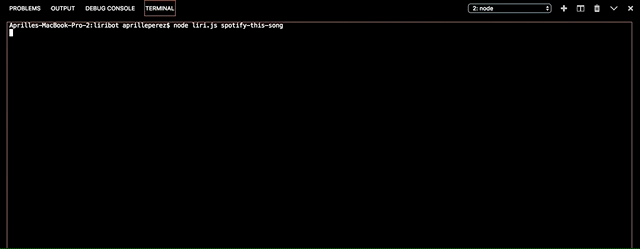

# LIRIBOT

# Description
Liribot is the command line version of Siri, taking in the command the user wants to execute. The commands the user can use are(case sensitive): 
- concert-this (retrieves latest concert information of searched artist/band)
- movie-this (retrives information about the movie searched)
- spotify-this-song (retrieves information about top 5 tracks related with that song)
- doWhatItSays (retrieves data from random.txt (file can only be one line) and determines which of the above listed function are to be run)

After declaring a command, the user can search up any query relaed to their command. The backend does the rest in terms of format and feeding it to the appropriate API. 

# Languages
- Node.js, JSON

# Important!
You will need to provide your own spotify Spotify-ID and Secret-ID in your own .env file. Please retrieve that data from: https://developer.spotify.com/

# APIs
- Bands in Town: http://www.artists.bandsintown.com/bandsintown-api
- OMDB: http://www.omdbapi.com/

# Dependencies
- Axios: https://www.npmjs.com/package/axios
- Dotenv: https://www.npmjs.com/package/dotenv
- Moment: https://www.npmjs.com/package/moment
- Spotify-Node-js: https://www.npmjs.com/package/node-spotify-api

# Takeaways
This was a really good practice into getting comfortable with API actions on the backend using node. I related Axios as the "AJAX method" of node (since the syntax is very similar). Because this is one of the first HW assignments that doesn't use the browser, it was interesting having to think through the inputs in the command line/terminal instead of browser inputs. I feel that the code was slightly easier to work with in that regard.

# Feedback
One thing I noticed is that in random.txt, if the text called for the concert-this function, the format has to be [command],[user query] --> no quotations, as compared to all other random.txt lines for the other functions which take on the format [command],"[user query]" --> user query wrapped in quotations. This is because the concert-this function is very particular on picking up the quotations and feeding this into the API's query URL. A very interesting bug to find and work out (thank you Trae & Arron).

# Demo
concert-this demo

movie-this demo

spotify-this-song demo

doWhatItSays demo

